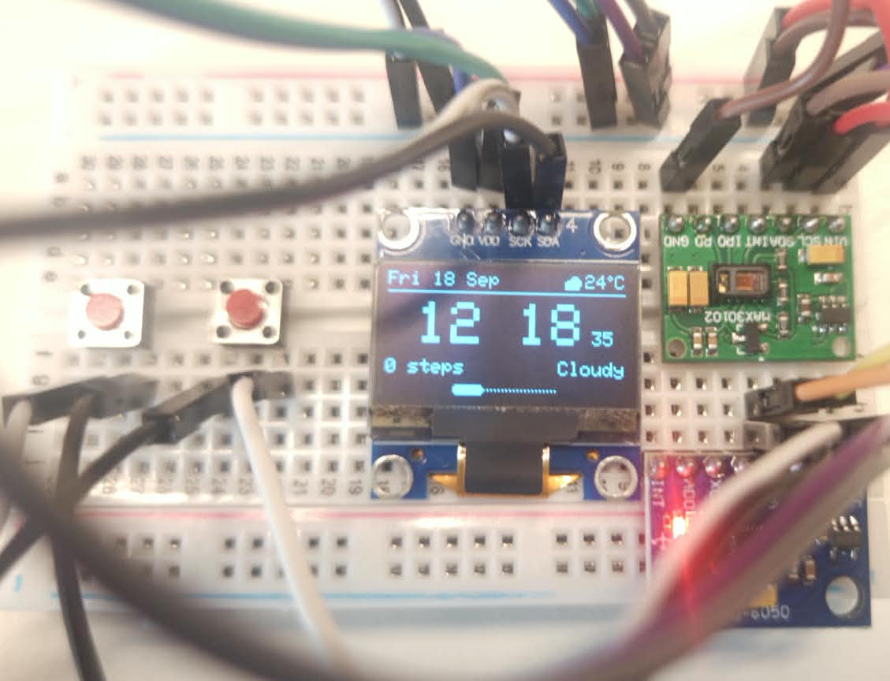
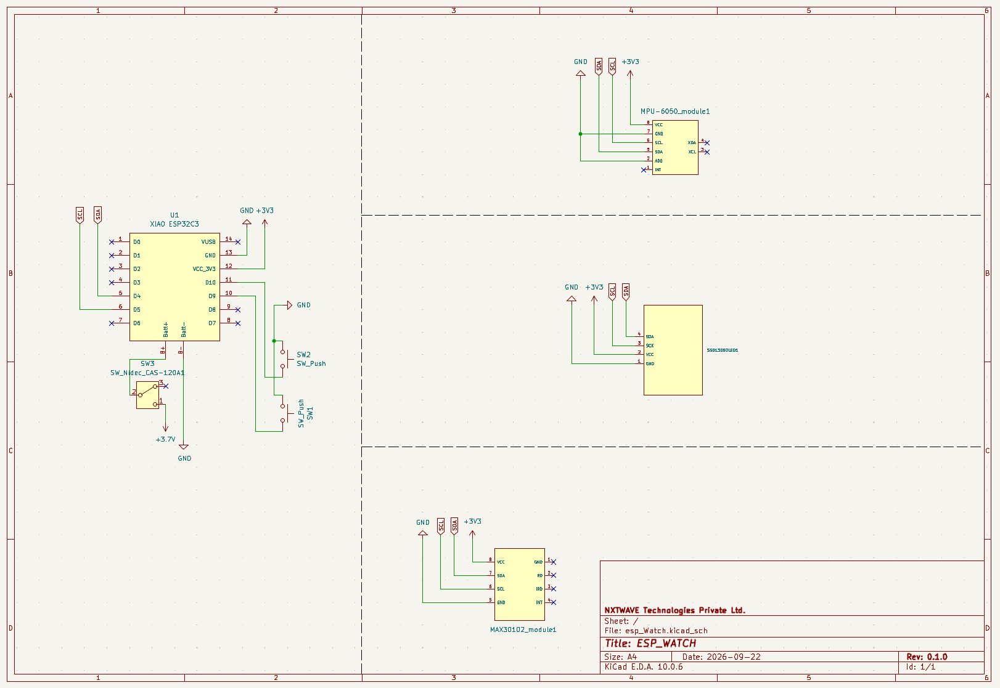
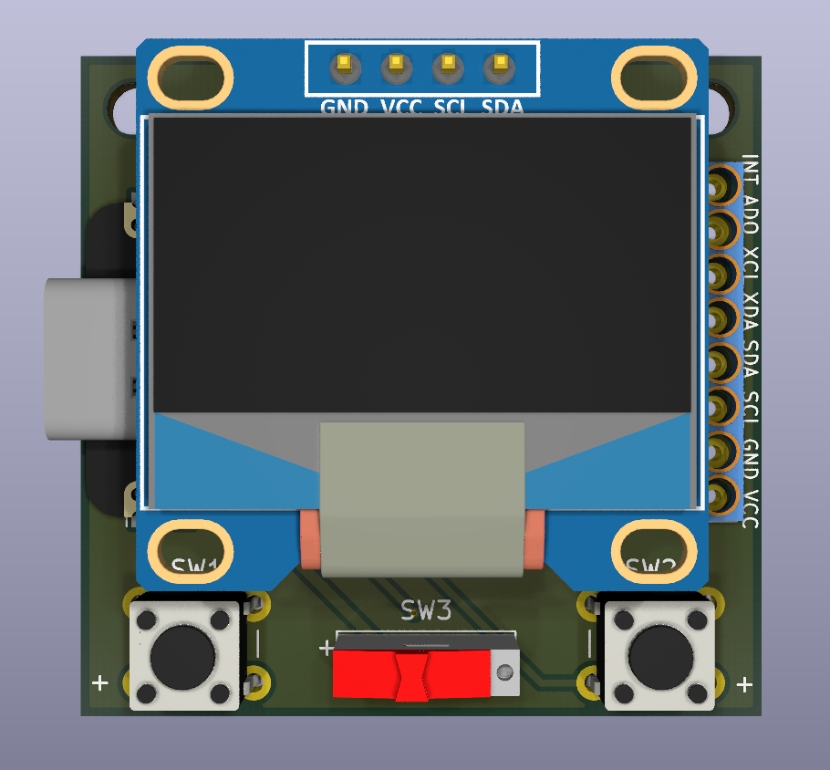
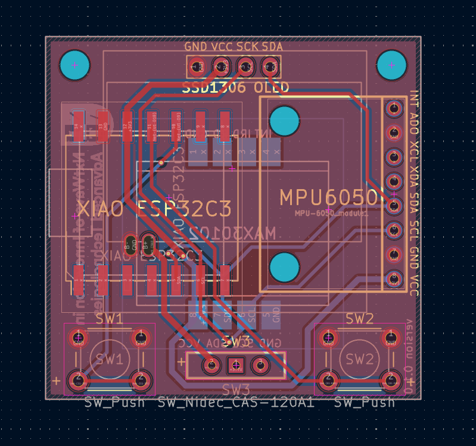

# ESP Watch

A custom ESP32-C3-based wearable device that combines a small OLED display, motion sensing, heart-rate sensing,
Wi-Fi/BLE connectivity, and a LiPo battery into a compact wrist-worn platform.

The project covers the complete product-development workflow — from breadboard prototyping and firmware development
to schematic capture, custom PCB design, fabrication, and enclosure CAD.

## Features

* **Seeed XIAO ESP32-C3**
* **0.96" 128×64 SSD1306 OLED**
* **MPU-6050** 6-axis IMU
* **MAX30102** heart-rate / SpO₂ sensor
* 2 user buttons
* LiPo battery operation
* Wi-Fi / Bluetooth Low Energy
* Custom 2-layer carrier PCB
* 3D-printed enclosure

---

## Hardware

| Component         | Details                    |
| ----------------- | -------------------------- |
| MCU               | XIAO ESP32-C3              |
| Display           | SSD1306 OLED, 128×64       |
| IMU               | MPU-6050                   |
| Heart-rate sensor | MAX30102                   |
| Communication     | Wi-Fi + BLE                |
| Power             | LiPo                       |
| PCB               | Custom 38 × 38 mm, 2-layer |

## System Architecture
                         LiPo Battery
                              │
                       Optional Switch
                              │
                       XIAO BAT+ / BAT-
                              │
                    ┌─────────┴─────────┐
                    │                   │
                 XIAO ESP32-C3       Charger
                    │
                  3.3 V
                    │
          ┌─────────┼──────────┐
          │         │          │
       SSD1306   MPU-6050   MAX30102
       OLED       IMU       HR / SpO₂
       0x3C       0x68         0x57
          │         │          │
          └─────────┴──────────┘
                 I²C Bus
             SDA = GPIO6
             SCL = GPIO7

       GPIO10 ── Next Button
       GPIO3 ── Previous Button

### Pinout

| XIAO Pin     | Function        |
| ------------ | --------------- |
| D4 / GPIO6   | I²C SDA         |
| D5 / GPIO7   | I²C SCL         |
| D10 / GPIO10 | Next button     |
| D1 / GPIO3   | Previous button |

The OLED, MPU-6050 and MAX30102 share the I²C bus. No interrupt pins are used for the MPU-6050 or MAX30102.

### Battery

The reference design currently treats the battery as a placeholder. The documented placeholder is:

Capacity: 400 mAh
Approximate dimensions: 20 × 5 × 13 mm

---

## Breadboard Prototype

The watch electronics were first assembled and tested on a breadboard before moving to the custom PCB.

**Figure 1 — Breadboard prototype**



*Initial ESP32-C3 smartwatch prototype with the display and sensor modules connected for firmware and hardware testing.*

Additional prototype photos are available in [`asset/breadboard/`](asset/breadboard/).

---

## Circuit Schematic

The final circuit was designed around the XIAO ESP32-C3 with the display and sensors connected through the I²C bus.

**Figure 2 — Circuit schematic**



*Complete schematic of the ESP Watch carrier board.*

---

## PCB Design

The prototype was converted into a custom 2-layer carrier PCB measuring approximately **38 × 38 mm**.

The custom carrier PCB is:
* 38 × 38 mm
* 2-layer
* Module-based design
* Custom KiCad schematic symbols
* Custom MAX30102 footprint
* Ground pours on both layers
* Hand-assembly oriented

**Figure 3 — PCB top view**



*Fully rendered top view showing the component placement and routing of the ESP Watch PCB.*

**Figure 4 — PCB front copper**



*Front copper layer showing signal and power routing.*

The repository also contains additional PCB views and renders in [`asset/pcb/`](asset/pcb/).

---

## Firmware

Firmware is written in Arduino C++ and can be developed using:

* **Arduino IDE** — `firmware/Arduino-IDE/`
* **PlatformIO** — `firmware/PlatformIO/`

The firmware interfaces with the display and sensors over I²C and handles the watch UI, buttons, motion and heart-rate functionality.

---

## Getting Started
### 1. Clone the repository
```bash
git clone https://github.com/niat-physicalai/esp_watch.git
cd esp_watch
```

### 2. Firmware

Choose one of the supported development environments:

firmware/
├── Arduino-IDE/
└── PlatformIO/

### Arduino IDE

Open:

`firmware/Arduino-IDE/esp_watch/esp_watch.ino`

Select the appropriate ESP32-C3 board configuration and upload the firmware.

### PlatformIO

Open:

`firmware/PlatformIO/esp_watch/`

using VS Code with the PlatformIO extension.

Then build and upload the project.

*Note** Exact board-manager/library versions and firmware configuration requirements should be verified against the current project files before treating them as fixed requirements.

---

## Repository Structure

```text
esp_watch/
├── asset/
│   ├── breadboard/      # Prototype photos
│   └── pcb/             # PCB renders and schematic
│
├── firmware/
│   ├── Arduino-IDE/     # Arduino IDE firmware
│   └── PlatformIO/      # PlatformIO project
│
├── README.md
└── dir.txt
```

---

## Status

* [x] Breadboard prototype
* [x] Firmware
* [x] PCB design
* [ ] PCB fabrication / assembly
* [ ] Enclosure development